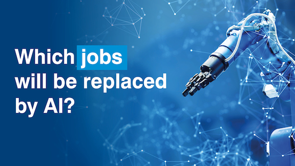
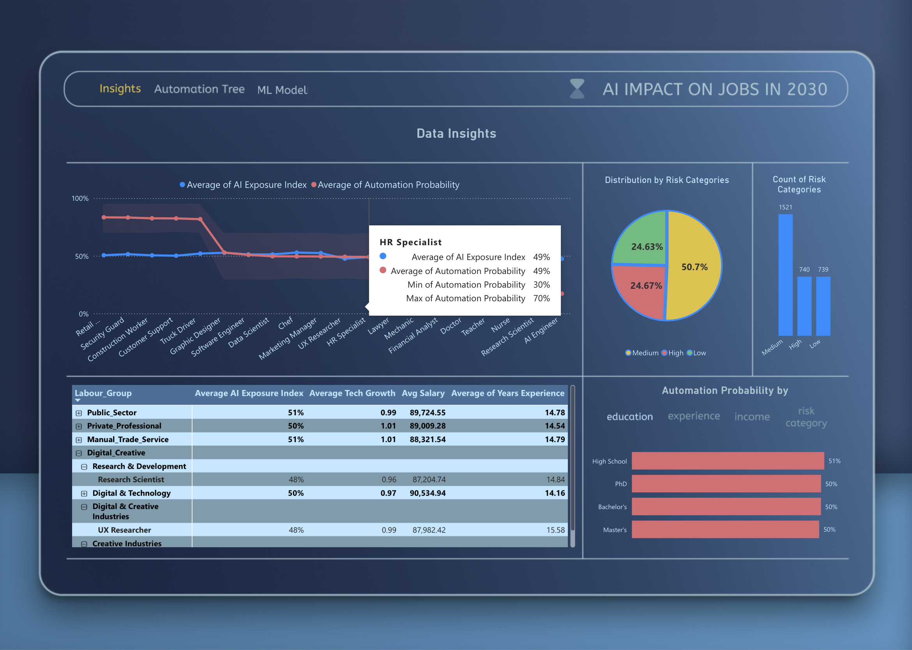
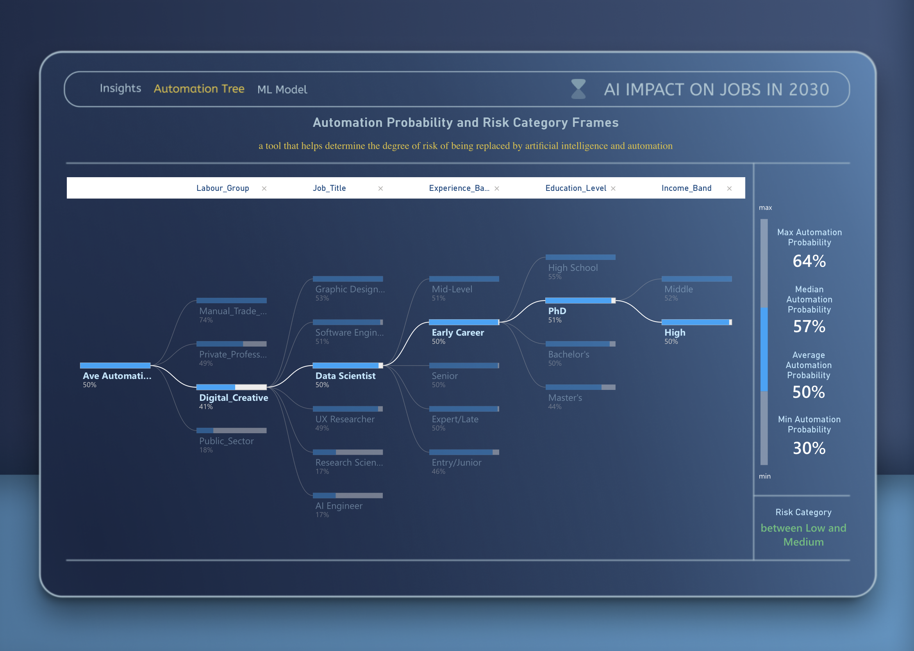

<h1 align="center">AI INFLUENCE ON JOBS IN 2030 – POWER BI REPORT</h1>

  

---

## Table of Contents
1. [Project Overview](#project-overview)
2. [Objectives](#objectives)
3. [Dataset](#dataset)
4. [App Structure](#app-structure)
5. [Report Interface](#report-interface)
6. [Key Findings](#key-findings)
7. [Machine Learning Model](#machine-learning-model)
8. [Requirements](#requirements)
9. [Contributing](#contributing)
10. [License](#license)
11. [Credits and Acknowledgements](#credits-and-acknowledgements)
12. [Author](#author)

---

## Project Overview
AI has become an integral part of modern society. However, the extent of its impact on the future labour market remains uncertain.  

This project analyzes the degree to which different job roles may experience automation risk by 2030 and highlights factors such as education, experience, and industry that may influence exposure.

The full interactive dashboard is built in **Power BI**, enhanced with **Python-based ML predictions** and feature engineering.

[OPEN DASHBOARD ON MICROSOFT SERVICES](https://app.powerbi.com/view?r=eyJrIjoiMTcxYmYwNDktODg0NC00NzhhLThmOGEtMTZhN2E1ODlmNmNmIiwidCI6IjU5YTZhM2Y5LTMwYWItNDBmZi1hNDZhLWYzZThkZDU4OGZhOSIsImMiOjl9)
(ML model disabled on public link for security restrictions)  

---

## Objectives
- Analyze the impact of AI and automation exposure on job categories
- Identify jobs and labour segments most and least at risk
- Build Decission Tree that indicates probability frames of risk level
- Train a Machine Learning model to predict automation risk level

---

## Dataset
**Name:** `AI_Impact_On_Jobs_2030_feature_enriched.csv`  
**Source:** Kaggle  
**Rows:** 3000  

Includes added engineered fields (bands, risk groupings, sector classification).

| Column                     | Description |
|----------------------------|-------------|
| Job_Title                  | Job title |
| Average_Salary             | Annual salary estimate |
| Years_Experience           | Experience required |
| Education_Level            | Minimum degree/qualification |
| AI_Exposure_Index          | Estimated intensity of AI disruption |
| Tech_Growth_Factor         | Expected technological development |
| Automation_Probability_2030| Probability of automation in coming decade |
| Risk_Category              | High/Medium/Low risk label |
| Skill_1 – Skill_10         | Required skills |
| Experience_Band            | Grouped years of experience |
| Income_Band                | Salary segment |
| Job_Sector                 | Industry classification |
| Labour_Group               | Worker classification |

### ⚠ Synthetic Data Disclaimer
This dataset is artificial and generated for educational purposes.  

- Results represent **simulated automation trends**, not real forecasts  
- Automation risk should **not be interpreted as verified occupational prediction**  
- The purpose is to demonstrate **Power BI + Python + ML integration**, not produce authoritative labour statistics  

---

## App Structure

1. **INSIGHTS TAB**  
   - Descriptive analysis + Exploratory Data Analysis views  

2. **AUTOMATION DECISION VIEW**  
   - Tree-style breakdown of automation probability  

3. **ML MODEL VIEW**  
   - Submit inputs + view predicted automation risk  

---

## Report Interface

  

  

  

---

## Key Findings
- Highest-risk jobs include: Retail Workers, Truck Drivers, Construction Workers, Customer Support roles  
- Low-risk roles include: Doctors, Nurses, Teachers, AI Engineers, Research Scientists  
- Lower income roles correlate with higher automation risk  
- Higher education and years of experience **alone do not guarantee job safety**  

---

## Machine Learning Model
The ML script is executed locally in Power BI Desktop using Python.  

### Model Used
**Random Forest Regressor**

### Target variable
`Automation_Probability_2030` (automation index)

### Input features used for prediction
- `Experience_Band`  
- `Income_Band`  
- `Job_Sector`  
- `Labour_Group`  
- `Job_Title`  
- `Education_Level`  

### Performance Metrics (Test Set)
| Metric | Score |
|-------|-------|
| MAE | **0.06** |
| RMSE | **0.083** |
| R² | **0.885** |

These values indicate strong predictive performance on synthetic data.

---

## Requirements
To use the ML model in Power BI Desktop:

1. Install Python  
2. Install required libraries

install using terminal:
pip install pandas==2.3.3 matplotlib==3.10.8 scikit-learn==1.8.0 numpy==2.3.0

4. Set Python path in Power BI Desktop  
`Options & Settings > Python scripting`

---

## Contributing
Contributions welcome.

1. Fork repo  
2. Create feature branch  
3. Commit changes  
4. Submit pull request  

For larger contributions, please also provide:  
- CONTRIBUTING.md  
- CODE_OF_CONDUCT.md  

---

## License
Distributed under the **MIT License**.

---

## Credits and Acknowledgements
Special thanks to:

- **Code Institute** walkthrough materials  
- Python community resources  
- Power BI and Microsoft documentation  
- Stack Overflow contributors  

---

## Author
**Volodymyr Babunych**  
📧 vbabunych@gmail.com  
📍 United Kingdom  
🗓️ November 2025
